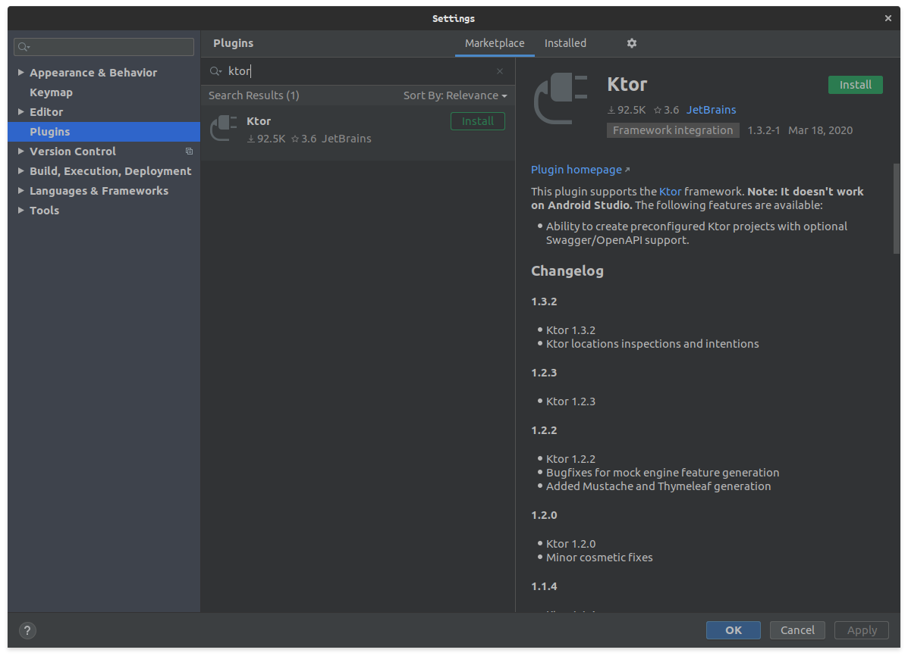
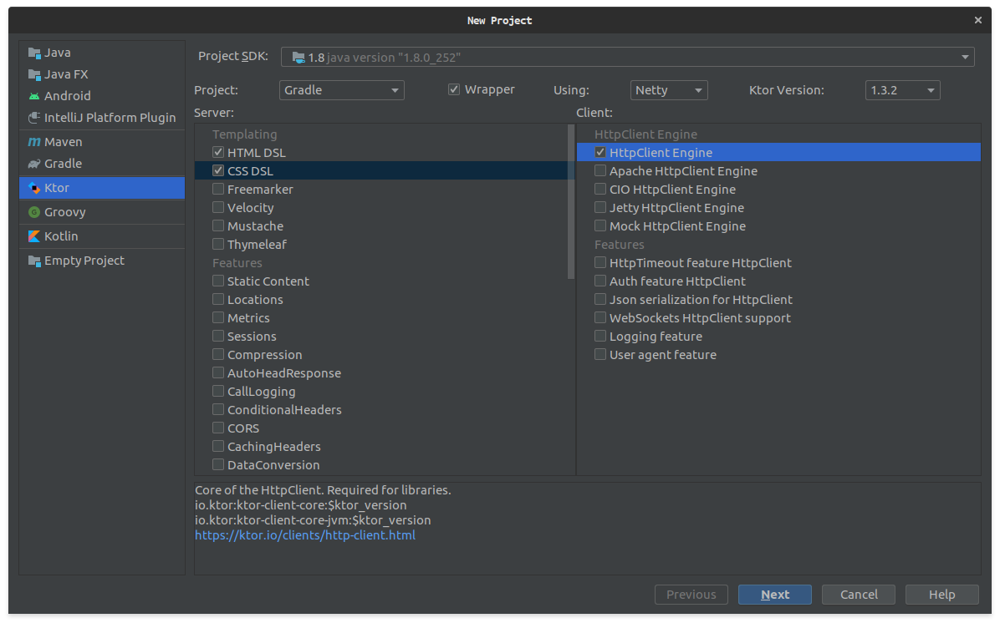
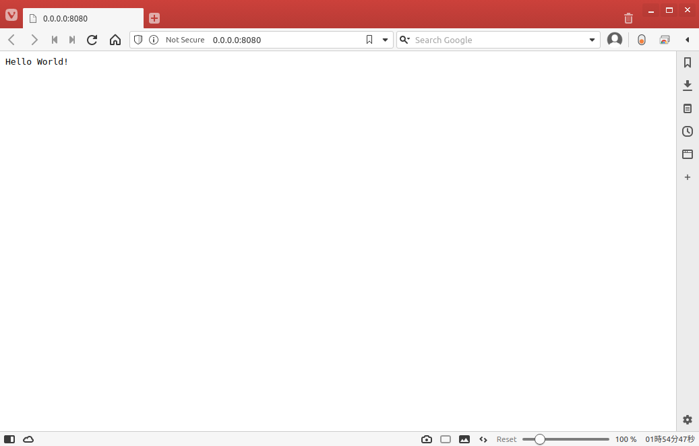

# Ktor で Hello World 

## はじめに

Ktor は Kotlin で Web アプリケーション・HTTPサービスを簡単に構築するためのフレームワークになります。Ktor は Kotlin coroutines をサポートしていて、アプリケーション構築に必要になる非同期処理に Kotlin coroutines を利用できます。今回は[Ktor QuickStart](https://ktor.io/quickstart/)を参考にしながら、Ktor のプロジェクトを作成して Hello World を表示できるまでセットアップしたいと思います。


## 実装

1. Plugin をインストールしないと、IntelliJ Idea で Ktor のプロジェクトを作成できません。なので Settings から Plugins を開き Ktor の Plugin をインストールします。



2. Ktor の Plugin をインストールしたら、Project から Ktor プロジェクトを作成します。

   （プロジェクト名称などの入力が求められるので任意の値を入力してください。）



3. Application.kt に次のコードを記載して起動する。

```kotlin
fun main(args: Array<String>) {
    // Netty と呼ばれる HTTP サーバーを 8080 ポートで起動する。
    val server = embeddedServer(Netty, port = 8080) {
        routing {
            // ルートにアクセスしたら、 Hello World! というプレインテキストを返す
            get("/") {
                call.respondText("Hello World!", ContentType.Text.Plain)
            }
            // demo にアクセスしたら、HELLO WORLD! というプレインテキストを返す。
            get("/demo") {
                call.respondText("HELLO WORLD!")
            }
        }
    }
    server.start(wait = true)
}
```

4. 起動したら https://0.0.0.0:8080 または https://0.0.0.0:8080/demo アクセスすると Hello World が表示されます。




## おわりに

Ktor でプロジェクトを作成して、Hello World を表示するまでやってみました。Ktor は IntelliJ IDEA がサポートしているため簡単にプロジェクトを作成できるみたいですね。Ktor の良し悪しに関してはまだわかりませんが少しずづ試して行きたいなと思っています。